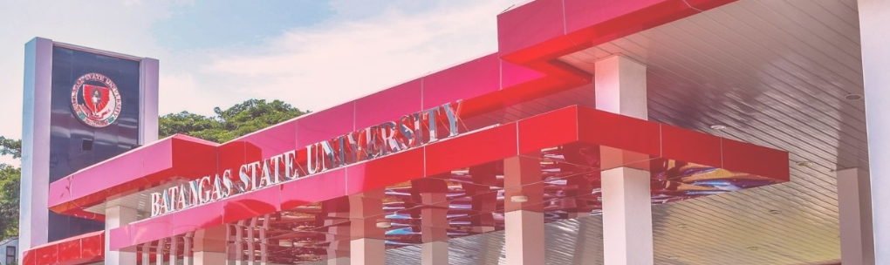

---
# EquipCheck: Safety Equipment Mapping and Maintenance Management System
---
# Introduction
---
Nowadays, safety equipment is frequently disregarded given that people do not know how to utilize and maintain it properly. Because of this ignorance, safety equipment may not be used effectively as aimed for, which may result in accidents and emergencies. Accidents typically happen as a result of unawareness, a lack of common sense, a failure to follow directions, or mistakes made when doing studies. However, emergencies and catastrophes have the potential to occur at any time, therefore, it's important to be prepared to respond to these. Emergency situations and catastrophes can strike at any time. Therefore, it must take steps toward preventing such in order to ensure that to become prepared for everything by properly mapping the floorplan, maintaining and monitoring the safety equipment effectively, so that the safety equipment is accessible, functional, and ready to use in the event of a disaster. Because all of the safety equipment was properly monitored and operational, it must be vital for people and organizations to be knowledgeable to take measures more quickly and efficiently in order to minimize the possibility of harm and damage. Utilizing safety equipment like fire extinguishers, smoke detectors, and fire sprinklers can make it easier to prevent emergencies and deal with catastrophes. 

# EQUIPCHECK: Safety Equipment Mapping and Maintenance Management System

The primary objective of this project is to achieve enhanced management of safety equipment, resulting in significant benefits for both the head admin, staff, and various offices mentioned, as well as fostering technological advancement throughout the campus. An integral component of this endeavor is the inclusion of a floorplan that allows for efficient mapping and identification of each safety equipment located within specific floors or buildings. 
This feature greatly enhances operational efficiency. Moreover, the ability to easily assess the functionality of each safety equipment further adds to the advantages of this system. 
In essence, the implementation of this system will empower the Environmental Management Unit and Project Facility Management Office with a centralized management approach, ultimately benefiting the entire university community.

## Installation of the application ##

Step 1:  Download the installer for Node LTS 

Step 2:  Install the ionic CLI globally: npm install -g ionic

Step 3:  Clone repository: https://github.com/charlesdimayuga3201/EquipCheck-Final.git

Step 4: Run npm install from the project root

Step 5: Run ionic serve in a terminal from project root

**After Installation of the application,**

Log in valid account credentials
After loggin in, the access on the system would be depends on the account type.
 If admin account is used, the user would be granted full access on functions and features of the system.
 If staff account is used, the access on the system would be limited.

## Admin Account Access ##
 
 • Update Roles
 
 • Review All Equipment
 
 • View Mapping
 
 • Update Equipment
 
 • View Records
 
 • View Equipment
 
## Staff Account Access ##
  
 • View Mapping
 
 • Update Equipment
 
 • View Records
 
 • View Equipment
 

Due to the rapid advancement of technology in our present era, there are numerous aspects that often go unnoticed and overlooked. However, this particular project stands out as truly noteworthy, as it offers invaluable assistance to clients in expediting their maintenance, checking, and inspection processes for essential safety equipment like fire extinguishers, smoke detectors, and sprinklers. 
What sets this project apart is its incorporation of a mapping feature, enabling staff members to conveniently locate and examine each safety equipment. Moreover, by compiling all the information for every equipment, tracking and accessing data becomes considerably swifter, thereby facilitating prompt determination of their condition and status.

This collaborative project was meticulously crafted and brought to life by an exceptional team of individuals. 
The brilliant minds behind its inception and development are Camat, Judea Hazel Mae, Cusi, Justine Carlo, and Dimayuga, Charles Keane. Each member of this talented group bears unique duties and responsibilities within the project.
Judea Hazel Mae Camat demonstrates exemplary expertise in overall documentation and design, while Justine Carlo Cusi provides invaluable support in documentation and Charles Keane Dimayuga pivotal role in overseeing the comprehensive programming aspects of this remarkable undertaking.

